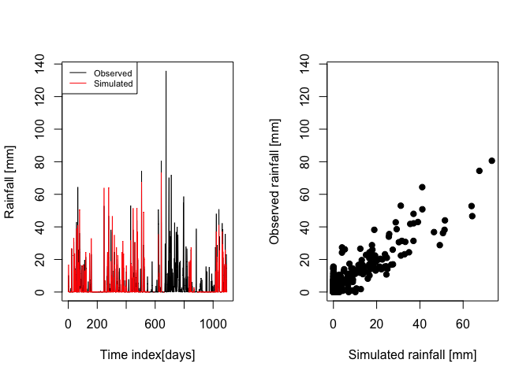

# Implementation of SM2RAIN algorithm in R

# Detecting rainfall from the bottom up\!

## `sm2rainR` R-package - What is it?

`sm2rainR` is an R package that implements the SM2RAIN algorithm of
[Brocca et al. (2013)](https://doi.org/10.1002/grl.50173), and [Brocca
et al. (2014)](https://doi.org/10.1002/2014JD021489) for estimating
rainfall from soil moisture data.

Full description of the SM2RAIN algorithm as well as validations of its
performance can be found in the above mentioned works.

For more details and datasets see also
[here](http://hydrology.irpi.cnr.it/research/sm2rain/) and
[here](http://www.irpi.cnr.it/en/focus/sm2rain/).

## If you do not believe it is possible, try yourself\!

The `sm2rainR` comes together with some data (hourly datasets of soil
moistrure and precipitation at 16 sites). Let’s load some of them:

``` r
library(sm2rainR)
ts_df=(data[[1]])
head(ts_df)
```

    ##       Date        SM Rain
    ## 1 733043.0 0.4831461    0
    ## 2 733043.0 0.4831461    0
    ## 3 733043.1 0.4823970    0
    ## 4 733043.1 0.4815409    0
    ## 5 733043.2 0.4810653    0
    ## 6 733043.2 0.4807627    0

``` r
tail(ts_df)
```

    ##           Date        SM Rain
    ## 26299 734138.8 0.5209397    0
    ## 26300 734138.8 0.5201831    0
    ## 26301 734138.8 0.5195292    0
    ## 26302 734138.9 0.5191011    0
    ## 26303 734138.9 0.5181024    0
    ## 26304 734139.0 0.5168539    0

### `sm2rainR` in action

Calibrate the SM2RAIN algorithm. The used in this example values for
`itermax` and `NP` are not reccomended (they are used here just for
computational speed). Please use higher values for both (e.g.,
itermax=100 and
    NP=30)

``` r
Opt=sm2rainCalib(fn=sm2rainNSE, data= ts_df, itermax=20, NP=10)
```

    ## Iteration: 1 bestvalit: 0.408351 bestmemit:   35.710261  527.527671  106.149830
    ## Iteration: 2 bestvalit: -0.774646 bestmemit:   99.307684    3.197116   14.222810
    ## Iteration: 3 bestvalit: -0.774646 bestmemit:   99.307684    3.197116   14.222810
    ## Iteration: 4 bestvalit: -0.774646 bestmemit:   99.307684    3.197116   14.222810
    ## Iteration: 5 bestvalit: -0.774646 bestmemit:   99.307684    3.197116   14.222810
    ## Iteration: 6 bestvalit: -0.774646 bestmemit:   99.307684    3.197116   14.222810
    ## Iteration: 7 bestvalit: -0.774646 bestmemit:   99.307684    3.197116   14.222810
    ## Iteration: 8 bestvalit: -0.774646 bestmemit:   99.307684    3.197116   14.222810
    ## Iteration: 9 bestvalit: -0.774646 bestmemit:   99.307684    3.197116   14.222810
    ## Iteration: 10 bestvalit: -0.774646 bestmemit:   99.307684    3.197116   14.222810
    ## Iteration: 11 bestvalit: -0.774646 bestmemit:   99.307684    3.197116   14.222810
    ## Iteration: 12 bestvalit: -0.774646 bestmemit:   99.307684    3.197116   14.222810
    ## Iteration: 13 bestvalit: -0.774646 bestmemit:   99.307684    3.197116   14.222810
    ## Iteration: 14 bestvalit: -0.774646 bestmemit:   99.307684    3.197116   14.222810
    ## Iteration: 15 bestvalit: -0.774651 bestmemit:   98.572299   10.410196   16.550301
    ## Iteration: 16 bestvalit: -0.787677 bestmemit:   59.076381   13.697113    7.179263
    ## Iteration: 17 bestvalit: -0.812600 bestmemit:   67.292570   24.609645    9.177006
    ## Iteration: 18 bestvalit: -0.812619 bestmemit:   80.035614    9.074405    6.754852
    ## Iteration: 19 bestvalit: -0.820897 bestmemit:   77.907364   13.933653    6.754852
    ## Iteration: 20 bestvalit: -0.820897 bestmemit:   77.907364   13.933653    6.754852

``` r
# The NSE value obtained by calibration
print(Opt$obj)
```

    ## [1] 0.8208972

``` r
# Estimate percipitation using SM2RAIN algorithm
Sim = sm2rain(PAR=Opt$params, data=ts_df, NN=24)
```

## Let’s make some plots

Compare the simulated and obvserved series of precipitation

``` r
par(mfrow=c(1,2))
plot(Sim$Pobs, t='l', col='black', xlab='Time index[days]', ylab='Rainfall [mm]')
lines(Sim$Psim, col='red' )
legend("topleft", legend=c("Observed", "Simulated"), col=c('black', 'red'), lty=c('solid','solid'), cex=0.7)
plot(Sim$Psim, Sim$Pobs, pch=19, xlab='Simulated rainfall [mm]', ylab='Observed rainfall [mm]')
```

<!-- -->
